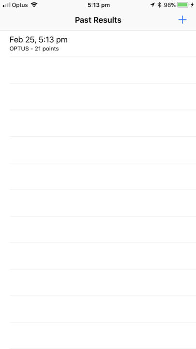

# PingPlotter

An app to collect network latency statistics, to help you decide which carrier is right for you.

---

In Sydney, Australia all carriers are generally not very performant (or usable) when it comes to using cellular data during peak hour on busy trains and stations. For this reason, I have built this app to determine which networks are the most performant (or useable).

Most peak hour train rides result in >30s round trip time, which results in practically unusable network connection.

Test your carrier to see if they are performing for you!

The app will run in the background whilst collecting data and will perform network latency tests on location updates.

## Disclaimer

I am not a Swift developer. I have past non commercial Objective C experience, however, which assisted in putting this app together.

This application makes use of a Private API to access the number of signal bars, and will probably break in iOS versions > 11 || < 11.

